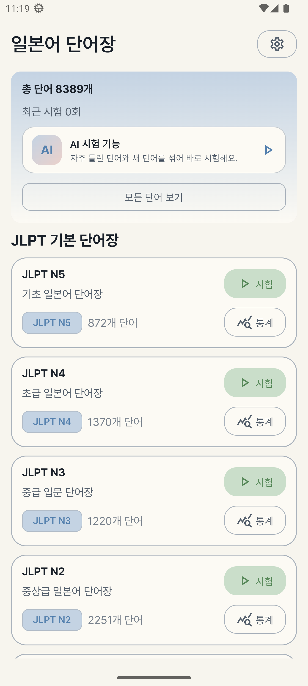
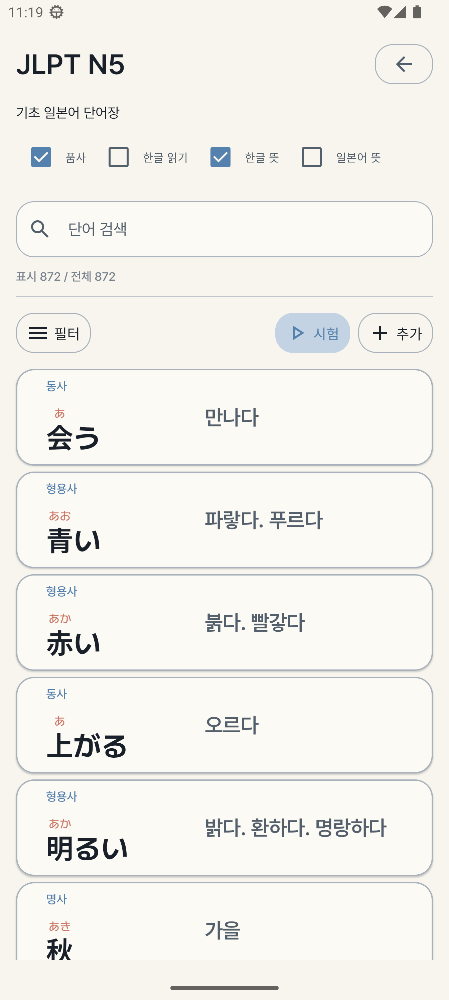
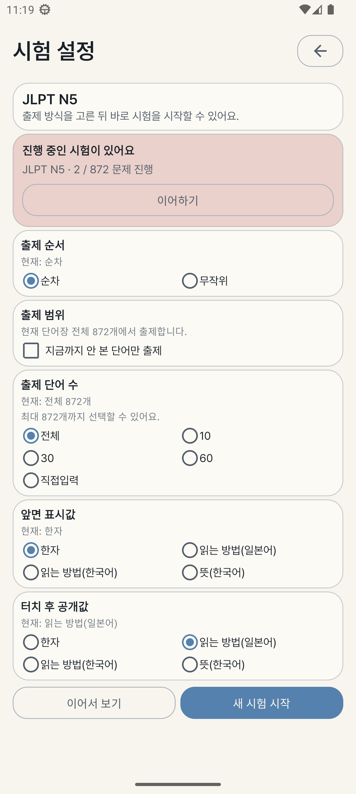
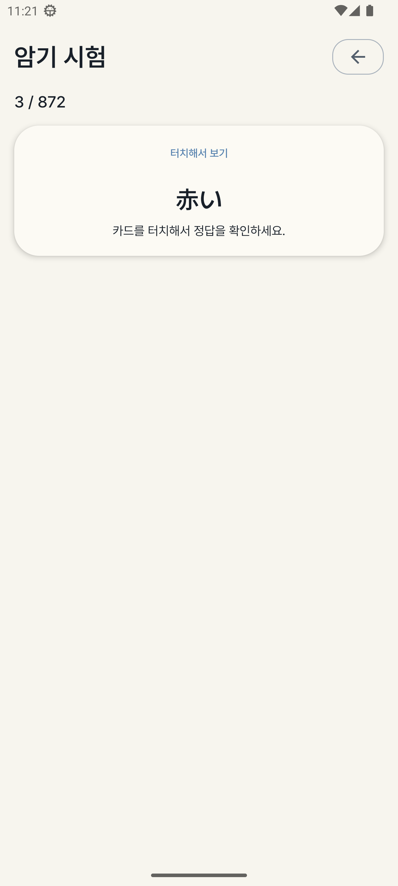

# 단어장 앱

일본어 단어를 직접 추가하고, JLPT 단어장을 학습하고, 시험 기록과 통계를 쌓아가며 복습할 수 있는 Android 앱입니다.  
`Kotlin + Jetpack Compose + Room` 기반으로 만들었고, 기본 단어장은 빌드 시점에 미리 생성한 SQLite 데이터베이스로 넣어 첫 실행이 느리지 않도록 구성했습니다.

## 주요 기능

- `JLPT N1 ~ N5` 기본 단어장 제공
- `커스텀 단어장` 생성 및 단어 직접 추가
- `AI 시험 기능`으로 자주 틀린 단어와 새 단어 중심 출제
- `단어사전 뷰`에서 뜻, 읽기, 예문, 연결 단어 탐색
- `암기 시험`
  - 순차 / 무작위 출제
  - 앞면 표시값 / 터치 후 공개값 선택
  - 전체 / 10 / 30 / 60 / 직접입력 출제 수 선택
  - 아직 시험 안 본 단어만 출제 옵션
  - 미완료 시험 이어하기
- `통계`
  - 단어별 오답 횟수, 응시 횟수, 오답률
  - 일자별 시험 기록
  - 단어장별 통계 화면과 날짜별 상세 화면
- `테마 프리셋`
  - 기본 라이트
  - VS Code Dark Modern
  - VS Code High Contrast
  - One Dark Pro

## 스크린샷

| 홈 | 단어장 목록 |
| --- | --- |
|  |  |

| 시험 설정 | 시험 진행 |
| --- | --- |
|  |  |

스크린샷은 `Android 13` 에뮬레이터 `S22Ultra_API33` 기준으로 촬영했습니다.

## 기술 스택

- `Kotlin`
- `Jetpack Compose`
- `Navigation Compose`
- `Room`
- `FastAPI`
- `SQLite`
- `Material 3`
- `Android Splash Screen`

## 실행 방법

### 1. 빠른 실행

프로젝트 루트에서 아래 명령을 실행하면:

- 시드 JSON으로부터 프리빌트 DB 생성
- 디버그 빌드
- 연결된 기기 또는 에뮬레이터에 설치
- 앱 실행

까지 한 번에 처리됩니다.

```powershell
powershell -ExecutionPolicy Bypass -File .\scripts\build-test.ps1
```

또는

```bat
.\scripts\build-test.bat
```

### 2. 자주 쓰는 옵션

```powershell
# 테스트 task 실행
powershell -ExecutionPolicy Bypass -File .\scripts\build-test.ps1 -GradleTask test

# 설치 없이 빌드만 수행
powershell -ExecutionPolicy Bypass -File .\scripts\build-test.ps1 -SkipInstall

# 실기기가 연결되어 있어도 에뮬레이터 우선 사용
powershell -ExecutionPolicy Bypass -File .\scripts\build-test.ps1 -PreferEmulator
```

## 데이터 구조

### 빌드 시 사용하는 원본 데이터

- 시드 원본 JSON: `data/seeds/jlpt_words.json`
- 원본 수집 자료: `data/sources/`

`data/sources/`에는 PDF, XLSX, JMdict 원본처럼 앱에 직접 포함되지 않는 자료를 둡니다.

### 앱에 포함되는 시드 데이터

- 프리빌트 DB: `app/src/main/assets/databases/wordbook.db`

앱은 첫 실행 때 JSON을 직접 파싱하지 않고, 빌드 시 생성된 SQLite 파일을 그대로 사용합니다.

## 백엔드와 동기화

v0.2부터는 로컬 Room DB를 유지하면서, 선택적으로 FastAPI 서버와 스냅샷 동기화를 할 수 있습니다.

- 서버 URL, 아이디, 비밀번호는 앱의 설정 화면에서 직접 입력합니다.
- 서버 주소나 개인 네트워크 정보는 소스코드에 하드코딩하지 않습니다.
- 동기화는 `수동 동기화`와 `시험 완료 시 자동 동기화` 중에서 선택할 수 있습니다.
- 서버 쪽은 `backend/` 아래의 FastAPI + Docker 구성으로 제공됩니다.

### 백엔드 빠른 실행

먼저 한 번만 가상환경을 만들고 의존성을 설치합니다.

```powershell
python -m venv venv
.\venv\Scripts\python -m pip install -r .\backend\requirements.txt
```

그 다음 로컬 실행:

```powershell
Set-Location .\backend
..\venv\Scripts\python -m uvicorn main:app --host 127.0.0.1 --port 8000
```

또는 Docker 실행:

```powershell
Set-Location .\backend
docker compose up --build
```

에뮬레이터에서는 서버 주소를 `http://10.0.2.2:8000` 으로 넣으면 됩니다.

## 프로젝트 구조

```text
app/src/main/java/com/mistbottle/jpnwordtrainer
├─ data
│  ├─ local
│  ├─ model
│  └─ repository
├─ ui
│  ├─ theme
│  └─ ...
scripts
├─ build-test.ps1
├─ build-test.bat
└─ generate_seed_db.py
data
├─ seeds
└─ sources
```

## 개발 메모

- 기본 DB는 빌드 전에 생성됩니다.
- 시험 답안은 각 문항마다 즉시 저장되고, 미완료 시험은 이어서 진행할 수 있습니다.
- 서버 동기화는 현재 로컬 스냅샷 전체를 기준으로 동작합니다.
- 진행 중인 시험이 있으면 서버 데이터를 내려받는 pull 동기화는 막습니다.
- 공개 저장소에는 원본 PDF/XLSX 같은 수집 자료를 직접 커밋하지 않도록 `data/sources/`를 분리해 두었습니다.
- 브랜치/릴리즈 운영 규칙은 `docs/RELEASE_WORKFLOW.md`에 정리되어 있습니다.
- `build` 태그를 옮겨 붙이면 해당 커밋 기준으로 릴리즈 APK 빌드가 실행됩니다.
- `build` 빌드가 성공하면 `vA.B.CCC` 버전 태그와 GitHub Release가 생성됩니다.
- 생성된 GitHub Release는 `published` 이벤트를 통해 별도 워크플로우에서 Firebase App Distribution으로 배포됩니다.
- 필요하면 `릴리즈를 Firebase에 배포` 워크플로우를 수동 실행해서 특정 릴리즈 태그만 다시 Firebase로 보낼 수 있습니다.
- GitHub Actions에서 버전 태그를 생성하려면 `WORKFLOW_PUSH_TOKEN` secret 이 필요합니다.
